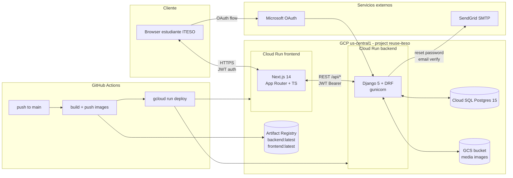
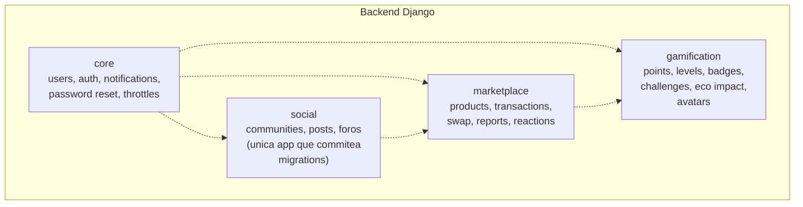
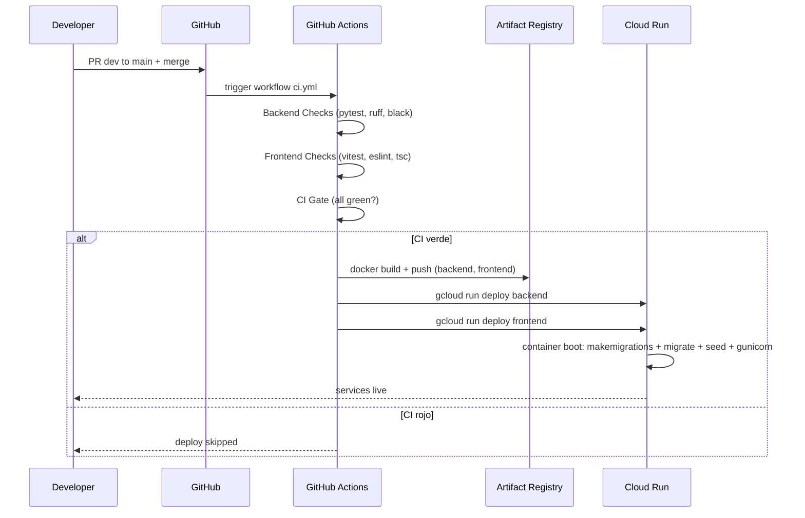
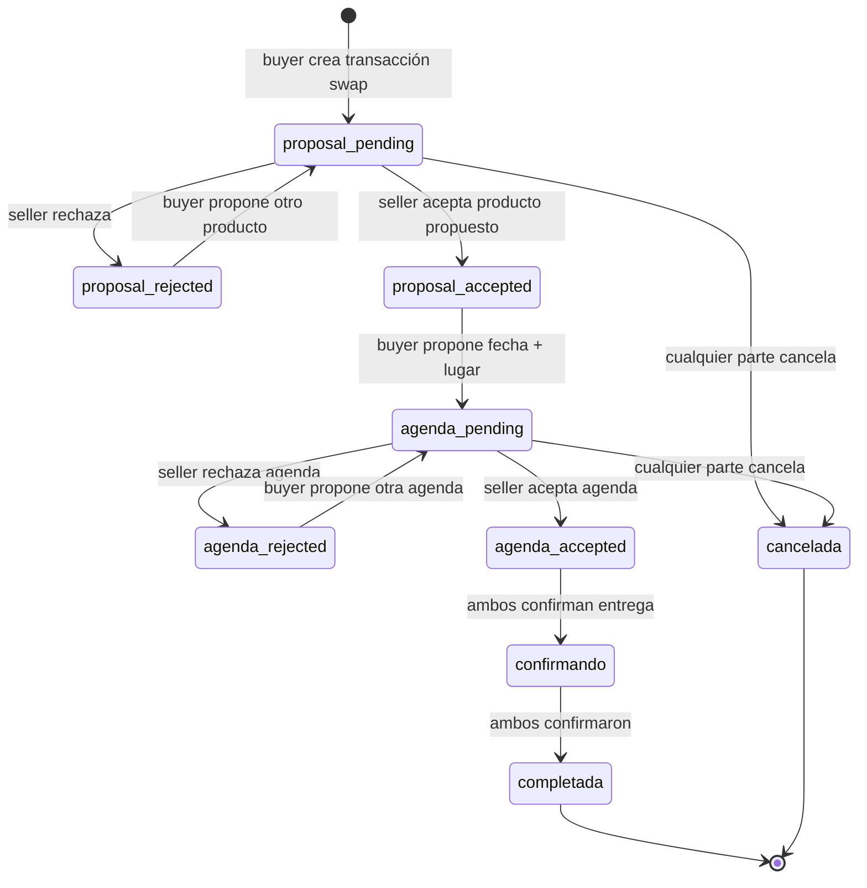

# Diagrama de arquitectura

```mermaid
flowchart LR
    subgraph CLIENT["Cliente"]
        Browser[Browser estudiante ITESO]
    end

    subgraph GCP["GCP us-central1 - project reuse-iteso"]
        subgraph FE["Cloud Run frontend"]
            NextJS[Next.js 14<br/>App Router + TS]
        end
        subgraph BE["Cloud Run backend"]
            Django[Django 5 + DRF<br/>gunicorn]
        end
        DB[(Cloud SQL Postgres 15)]
        GCS[(GCS bucket<br/>media images)]
        AR[(Artifact Registry<br/>backend:latest<br/>frontend:latest)]
    end

    subgraph EXT["Servicios externos"]
        SendGrid[SendGrid SMTP]
        MS[Microsoft OAuth]
    end

    subgraph CI["GitHub Actions"]
        Push[push to main] --> Build[build + push images]
        Build --> AR
        Build --> Deploy[gcloud run deploy]
    end

    Browser <-->|HTTPS<br/>JWT auth| NextJS
    NextJS <-->|REST /api/*<br/>JWT Bearer| Django
    Django <--> DB
    Django <--> GCS
    Django -->|reset password<br/>email verify| SendGrid
    Browser -->|OAuth flow| MS
    MS --> Django
    Deploy --> FE
    Deploy --> BE
```

## Apps backend

```mermaid
flowchart TB
    subgraph BE["Backend Django"]
        Core["core<br/>users, auth, notifications,<br/>password reset, throttles"]
        MKT["marketplace<br/>products, transactions,<br/>swap, reports, reactions"]
        Social["social<br/>communities, posts, foros<br/>(unica app que commitea<br/>migrations)"]
        Gam["gamification<br/>points, levels, badges,<br/>challenges, eco impact,<br/>avatars"]
    end
    Core -.-> MKT
    Core -.-> Social
    Core -.-> Gam
    MKT -.-> Gam
    Social -.-> MKT
```

## Flujo de deploy

```mermaid
sequenceDiagram
    participant Dev as Developer
    participant GH as GitHub
    participant CI as GitHub Actions
    participant AR as Artifact Registry
    participant CR as Cloud Run

    Dev->>GH: PR dev to main + merge
    GH->>CI: trigger workflow ci.yml
    CI->>CI: Backend Checks (pytest, ruff, black)
    CI->>CI: Frontend Checks (vitest, eslint, tsc)
    CI->>CI: CI Gate (all green?)
    alt CI verde
        CI->>AR: docker build + push (backend, frontend)
        CI->>CR: gcloud run deploy backend
        CI->>CR: gcloud run deploy frontend
        CR->>CR: container boot: makemigrations + migrate + seed + gunicorn
        CR-->>Dev: services live
    else CI rojo
        CI-->>Dev: deploy skipped
    end
```

## Estado de la transacción swap (HU-MKT-12)

```mermaid
stateDiagram-v2
    [*] --> proposal_pending: buyer crea transacción swap
    proposal_pending --> proposal_rejected: seller rechaza
    proposal_pending --> proposal_accepted: seller acepta producto propuesto
    proposal_rejected --> proposal_pending: buyer propone otro producto
    proposal_accepted --> agenda_pending: buyer propone fecha + lugar
    agenda_pending --> agenda_rejected: seller rechaza agenda
    agenda_pending --> agenda_accepted: seller acepta agenda
    agenda_rejected --> agenda_pending: buyer propone otra agenda
    agenda_accepted --> confirmando: ambos confirman entrega
    confirmando --> completada: ambos confirmaron
    proposal_pending --> cancelada: cualquier parte cancela
    agenda_pending --> cancelada: cualquier parte cancela
    completada --> [*]
    cancelada --> [*]
```
